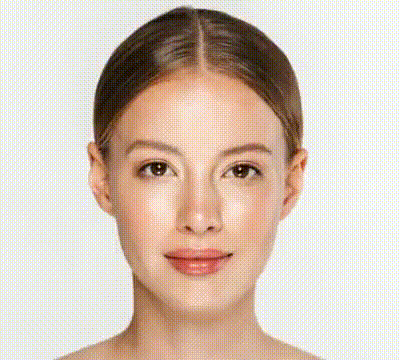

# Optical Flow

A Python implementation of optical flow techniques for creating artistic image morphing effects, inspired by the work of artist [Ryoichi Kurokawa](https://www.ryoichikurokawa.com).

Recently, I explored how images morph in Kurokawa's [artwork](https://www.ryoichikurokawa.com/project/ground.html). I was captivated by how he transitions between photographs. I discovered that the techniques involve Max/MSP original effects and timewarp effects from After Effects. The core technique behind these effects is optical flow. This project implements these effects using OpenCV and Python.

## Demo

|                               Default Optical Flow                               |                                       Optical Flow with Feedback                                       |                                          Enhanced Feedback Effect                                          |
| :------------------------------------------------------------------------------: | :----------------------------------------------------------------------------------------------------: | :--------------------------------------------------------------------------------------------------------: |
|  |  |  |

## Features

-   **Dense Optical Flow** - Calculate optical flow between two frames using OpenCV's Farneback algorithm
-   **Frame Interpolation** - Generate smooth intermediate frames for morphing effects
-   **Real-time Parameters** - Adjust optical flow parameters in real-time through an interactive UI
-   **Multiple Modes** - Different optical flow modes for various artistic effects
-   **Feedback Effects** - Create complex visual effects by incorporating feedback loops
-   **Flow Visualization** - Debug and visualize optical flow with arrows and HSV color mapping
-   **Performance Optimization** - Configurable frame downscaling for faster processing

## Installation

1. **Clone the repository:**

    ```bash
    git clone <repository-url>
    cd optical-flow
    ```

2. **Create and activate a virtual environment:**

    ```bash
    python -m venv venv
    source venv/bin/activate  # On Windows: venv\Scripts\activate
    ```

3. **Install dependencies:**
    ```bash
    pip install -r requirements.txt
    ```

## Usage

### Basic Usage

Run with default example images:

```bash
python main.py
```

### Example Presets

```bash
# Example 1: Face morphing
python main.py --exemple1

# Example 2: AI-generated images
python main.py --exemple2

# Example 3: Alternative AI images
python main.py --exemple3
```

### Custom Images

```bash
# Use your own images
python main.py --image_a ./path/to/first/image.jpg --image_b ./path/to/second/image.jpg
```

### Interactive Controls

Once running, use the interactive UI to adjust parameters in real-time:

-   **Pyramid Scale**: Controls the scale factor between pyramid levels
-   **Levels**: Number of pyramid levels
-   **Window Size**: Size of the neighborhood window
-   **Iterations**: Number of iterations at each pyramid level
-   **Poly N**: Size of the pixel neighborhood for polynomial expansion
-   **Poly Sigma**: Standard deviation for Gaussian weighting
-   **Gaussian**: Gaussian blur strength
-   **Slow Motion**: Controls animation speed
-   **Feedback**: Enables feedback effects for complex visuals
-   **Optical Mode**: Different flow calculation modes (0: default, 1: warp A only, 2: warp B only)

## Project Structure

```
optical-flow/
├── main.py              # Main application entry point
├── flow.py              # Optical flow calculation functions
├── ui.py                # Interactive user interface
├── cli.py               # Command-line argument parsing
├── timer.py             # Timing utilities
├── requirements.txt     # Python dependencies
├── public/              # Example images and output
└── prev/                # Previous implementations and experiments
```

## Technical Details

This project implements dense optical flow using OpenCV's Farneback algorithm. The technique calculates motion vectors between consecutive frames, which are then used to warp images and create smooth morphing transitions.

### Key Algorithms Used:

-   **Farneback Optical Flow**: For dense motion estimation
-   **Image Warping**: Using calculated flow fields
-   **Pyramid Processing**: Multi-scale analysis for robust flow estimation
-   **Polynomial Expansion**: For sub-pixel accuracy

## Acknowledgments

-   Inspired by the artistic work of [Ryoichi Kurokawa](https://www.ryoichikurokawa.com/)
-   Built with OpenCV and Python
-   Thanks to the computer vision community for optical flow research
